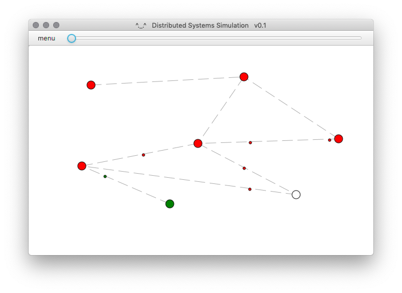

# Distributed Algorithms Simulator

Currently, the simulator is maintained by the [Distributed Systems Group](http://www.uni-kassel.de/eecs/vs) (*info(at)das-lab.net*)

The simulator allows the creation of nodes, their connection, and their communication via messages. Each of these classes provide interface for the implementation of own algorithms. Furthermore, a graphical user interface is provided to support the debugging of the algorithms. This is supported by a log and adjustable communication speed.

Original was developed by Thomas Weise (GitHub profile https://github.com/thomasWeise, website http://iao.hfuu.edu.cn/5)
